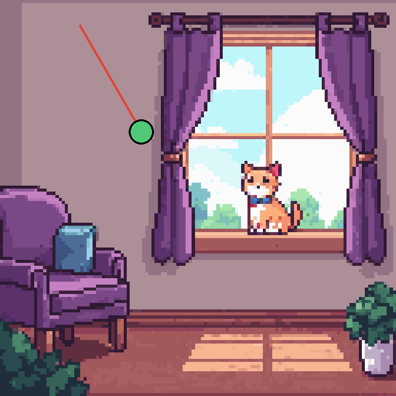
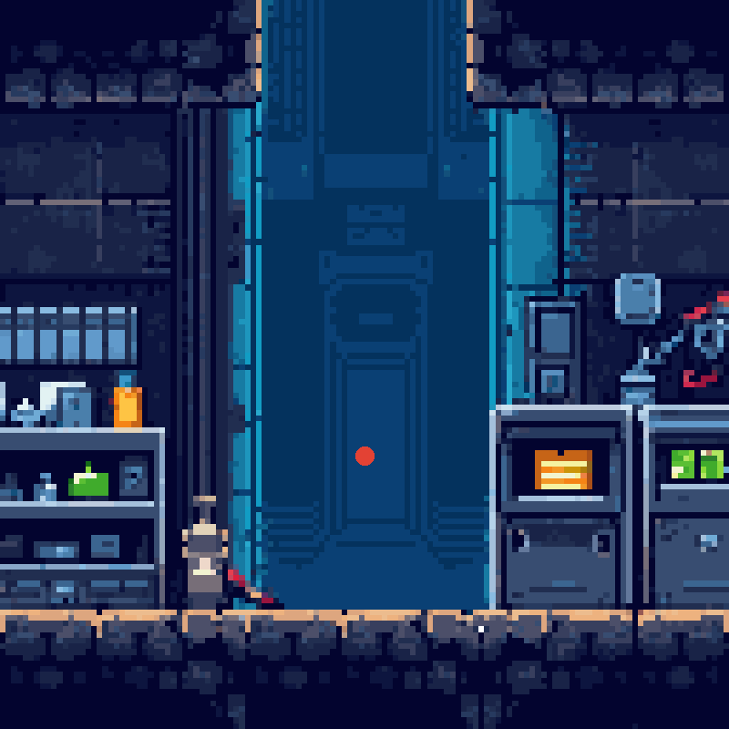
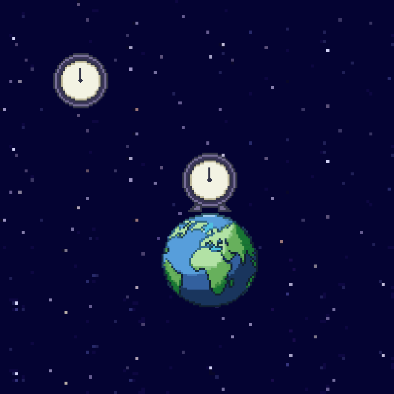
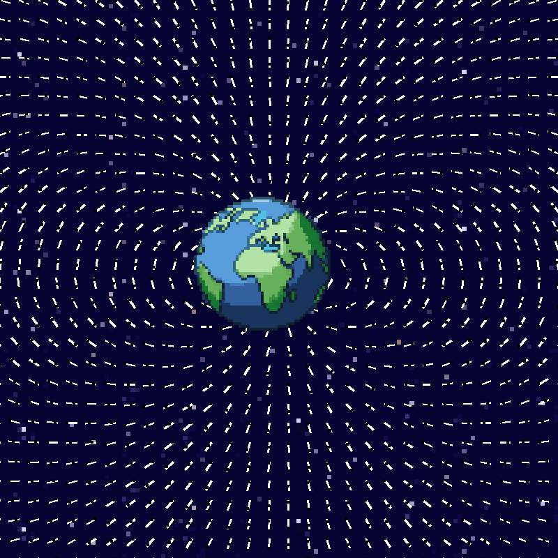

# Pyvert, Adventures in Physics with 8-bit Animations


> The computer revolution is a revolution in the way we think and in the way we express what we think.
>
> — gjs

## Introduction

Physics concepts distilled and animated with Python (NumPy, Pillow).

## Classical Mechanics

### Newton Mechanics

#### Newton's Second Law

The more massive an object is, the more force is required to accelerate it.


```python
import numpy as np
from PIL import Image


def newton_second_law(
    force: float,
    mass: float,
) -> float:
    acceleration = force / mass

    return acceleration


def euler_cromer(
    position: float,
    velocity: float,
    acceleration: float,
    delta_time: float,
) -> tuple[float, float]:
    velocity_next = velocity + acceleration * delta_time
    position_next = position + velocity_next * delta_time

    return position_next, velocity_next


def compute_positions(
    initial_position: float,
    initial_velocity: float,
    mass: float,
    force: float,
    delta_time: float,
    nb_position: int,
) -> np.ndarray:
    velocity = initial_velocity
    position = initial_position
    positions = np.zeros(nb_position)

    for i in range(len(positions)):
        position, velocity = euler_cromer(
            position,
            velocity,
            newton_second_law(force, mass),
            delta_time,
        )
        positions[i] = position

    return positions


def simulate() -> tuple[np.ndarray, np.ndarray]:
    force = 1000
    delta_time = 0.02
    nb_position = 250
    car_positions = compute_positions(0, 0, 20, force, delta_time, nb_position)
    bus_positions = compute_positions(0, 0, 100, force, delta_time, nb_position)

    return car_positions, bus_positions


def animate(
    car_positions: np.ndarray,
    bus_positions: np.ndarray,
) -> None:
    background = Image.open("img/track.png").convert("RGB")
    car_image = Image.open("img/car.png").convert("RGBA")
    bus_image = Image.open("img/bus.png").convert("RGBA")
    frames = []

    for i in range(len(car_positions)):
        frame = background.copy()
        frame.paste(car_image, (int(car_positions[i] + 50), 120), car_image)
        frame.paste(bus_image, (int(bus_positions[i] + 150), 295), bus_image)
        frames.append(frame)

    frames[0].save(
        "img/newton_second_law.gif",
        save_all=True,
        append_images=frames[1:],
        duration=20,
        loop=0,
    )


if __name__ == "__main__":
    animate(*simulate())
```

References:

- [Newton's Second Law](https://en.wikipedia.org/wiki/Newton%27s_laws_of_motion)
- [Euler-Cromer](https://en.wikipedia.org/wiki/Semi-implicit_Euler_method)

#### Newton's Third Law

For every action, there is an equal and opposite reaction.


```python
import numpy as np
from PIL import Image


def newton_third_law(
    force: float,
) -> float:
    return -force


def euler_cromer(
    position: float,
    velocity: float,
    acceleration: float,
    delta_time: float,
) -> tuple[float, float]:
    velocity_next = velocity + acceleration * delta_time
    position_next = position + velocity_next * delta_time

    return position_next, velocity_next


def simulate() -> np.ndarray:
    rocket_position = 0.0
    rocket_velocity = 0.0
    positions = np.zeros(250)

    for i in range(len(positions)):
        rocket_position, rocket_velocity = euler_cromer(
            rocket_position,
            rocket_velocity,
            newton_third_law(5000) / 150,
            0.02,
        )
        positions[i] = rocket_position

    return positions


def animate(
    positions: np.ndarray,
) -> None:
    background = Image.open("img/beach.png").convert("RGB")
    rocket_image = Image.open("img/rocket.png").convert("RGBA")
    frames = []

    for i in range(len(positions)):
        frame = background.copy()
        frame.paste(rocket_image, (350, int(positions[i] + 280)), rocket_image)
        frames.append(frame)

    frames[0].save(
        "img/newton_third_law.gif",
        save_all=True,
        append_images=frames[1:],
        duration=20,
        loop=0,
    )


if __name__ == "__main__":
    animate(simulate())
```

References:

- [Newton's Third Law](https://en.wikipedia.org/wiki/Newton%27s_laws_of_motion)
- [Euler-Cromer](https://en.wikipedia.org/wiki/Semi-implicit_Euler_method)

#### Newton's Law of Universal Gravitation

Every mass pulls every other — the bigger and closer, the harder they tug.


```python
import numpy as np
from PIL import Image, ImageDraw


def kepler_third_law(
    orbital_period: float,
    elliptical_semi_major_axis: float,
    sun_mass: float,
    planet_mass: float,
) -> float:
    gravitational_constant = (
        (4 * np.pi**2)
        / (orbital_period**2 * (sun_mass + planet_mass))
        * elliptical_semi_major_axis**3
    )

    return gravitational_constant


def newton_law_universal_gravitation(
    gravitational_constant: float,
    mass1: float,
    mass2: float,
    displacement_vector: np.ndarray,
) -> np.ndarray:
    distance = np.linalg.norm(displacement_vector) + 1e-20
    unit_vector = displacement_vector / distance
    magnitude = -gravitational_constant * mass1 * mass2 / distance**2
    force = magnitude * unit_vector

    return force


def euler_cromer(
    position: np.ndarray,
    velocity: np.ndarray,
    acceleration: np.ndarray,
    delta_time: float,
) -> tuple[np.ndarray, np.ndarray]:
    velocity_next = velocity + acceleration * delta_time
    position_next = position + velocity_next * delta_time

    return position_next, velocity_next


def simulate() -> np.ndarray:
    sun_mass = 1
    earth_orbital_period = 1
    earth_semi_major_axis = 1
    halley_mass = 1e-20
    halley_semi_major_axis = 17.737
    halley_perihelie = 0.59278

    gravitational_constant = kepler_third_law(
        earth_orbital_period,
        earth_semi_major_axis,
        sun_mass,
        halley_mass,
    )
    vis_viva = np.sqrt(
        gravitational_constant
        * (sun_mass + halley_mass)
        * (2 / halley_perihelie - 1 / halley_semi_major_axis)
    )

    positions = np.zeros((42100, 2))
    positions[0] = np.array([halley_perihelie, 0.0])
    velocity = np.array([0.0, -vis_viva])

    for i in range(len(positions) - 1):
        acceleration = (
            newton_law_universal_gravitation(
                gravitational_constant,
                sun_mass,
                halley_mass,
                positions[i],
            )
            / halley_mass
        )
        position, velocity = euler_cromer(
            positions[i],
            velocity,
            acceleration,
            0.0018,
        )
        positions[i + 1] = position

    return positions[1:]


def animate(
    positions: np.ndarray,
) -> None:
    background = Image.open("img/outerspace.png").convert("RGB")
    sun_image = Image.open("img/sun.png").convert("RGBA")
    frames = []
    trail_pixels: list = []
    last_trail_pixel = None
    comet_radius = 4

    for i in range(len(positions)):
        if i % 50 == 0:
            frame = background.copy()
            draw = ImageDraw.Draw(frame)
            frame.paste(sun_image, (530, 335), sun_image)
            trail_pixel = (
                int(700 + positions[i][0] * 19),
                int(400 - positions[i][1] * 19),
            )

            if last_trail_pixel is not None:
                trail_pixels.append((last_trail_pixel, trail_pixel))

            last_trail_pixel = trail_pixel

            for start, end in trail_pixels:
                draw.line([start, end], fill=(190, 243, 253), width=2)

            draw.ellipse(
                [
                    trail_pixel[0] - comet_radius,
                    trail_pixel[1] - comet_radius,
                    trail_pixel[0] + comet_radius,
                    trail_pixel[1] + comet_radius,
                ],
                fill=(219, 243, 253),
            )
            frames.append(frame)

    frames[0].save(
        "img/newton_law_universal_gravitation.gif",
        save_all=True,
        append_images=frames[1:],
        optimize=False,
        duration=20,
        loop=0,
    )


if __name__ == "__main__":
    animate(simulate())
```

References:

- [Newton's Law of Universal Gravitation](https://en.wikipedia.org/wiki/Newton's_law_of_universal_gravitation)
- [Kepler's Laws](https://en.wikipedia.org/wiki/Kepler's_laws_of_planetary_motion)
- [Halley's Comet](https://en.wikipedia.org/wiki/Halley%27s_Comet)
- [Euler-Cromer](https://en.wikipedia.org/wiki/Semi-implicit_Euler_method)
- [Vis-Viva Equation](https://en.wikipedia.org/wiki/Vis-viva_equation)

#### Newtonian Harmonic Oscillator

Sinusoidal functions describe the motion of free, undamped oscillations.


```python
import numpy as np
from PIL import Image, ImageDraw


def harmonic_oscillator(
    amplitude: float,
    angular_frequency: float,
    phase: float,
    times: np.ndarray,
) -> np.ndarray:
    return amplitude * np.cos(angular_frequency * times + phase)


def simulate() -> np.ndarray:
    return harmonic_oscillator(1, -5, np.pi, np.linspace(0, 10, 300))


def convert_pixel(
    pixel_x: float,
    pixel_y: float,
) -> tuple[int, int]:
    return (int(160 + pixel_x * 100), int(50 - pixel_y * 100))


def generate_spring(
    nb_segment: int,
) -> np.ndarray:
    spring = np.zeros((2, nb_segment + 2))
    spring[:, -1] = [0, -1]

    for i in range(1, nb_segment + 1):
        spring[0, i] = -1 / (2 * nb_segment) if i % 2 else 1 / (2 * nb_segment)
        spring[1, i] = -(2 * i - 1) / (2 * nb_segment)

    return spring


def animate(
    positions: np.ndarray,
) -> None:
    background = Image.open("img/livingroom.png").convert("RGB")
    ball_radius = 25
    rest_length = 2
    frames = []
    spring = generate_spring(30)

    for i in range(len(positions)):
        frame = background.copy()
        draw = ImageDraw.Draw(frame)
        current_length = rest_length + positions[i]
        width_scale = 8 / current_length
        height_scale = current_length
        spring_pixels = []

        for j in range(spring.shape[1]):
            spring_pixels.append(
                convert_pixel(
                    spring[0, j] * width_scale,
                    spring[1, j] * height_scale,
                )
            )

        for j in range(len(spring_pixels) - 1):
            draw.line(
                [spring_pixels[j], spring_pixels[j + 1]],
                fill=(227, 66, 52),
                width=4,
            )

        ball_center_pixel = convert_pixel(0, -current_length)
        ball_bounding_box = [
            ball_center_pixel[0] - ball_radius,
            ball_center_pixel[1] - ball_radius,
            ball_center_pixel[0] + ball_radius,
            ball_center_pixel[1] + ball_radius,
        ]
        draw.ellipse(ball_bounding_box, fill=(80, 200, 120), outline=(0, 0, 0), width=4)
        frames.append(frame)

    frames[0].save(
        "img/newtonian_harmonic_oscillator.gif",
        save_all=True,
        append_images=frames[1:],
        duration=30,
        loop=0,
    )


if __name__ == "__main__":
    animate(simulate())
```

References:

- [Harmonic Oscillator](https://en.wikipedia.org/wiki/Harmonic_oscillator)

### Lagrangian Mechanics

#### Lagrangian Harmonic Oscillator

Lagrangian equations show that the motion of a free, undamped oscillator is described by sinusoidal functions.


```python
import numpy as np
from PIL import Image, ImageDraw


def lagrangian(
    mass: float,
    stiffness: float,
    position: np.ndarray,
    velocity: np.ndarray,
) -> np.ndarray:
    kinetic_energy = 1 / 2 * mass * velocity**2
    potential_energy = 1 / 2 * stiffness * position**2

    return kinetic_energy - potential_energy


def euler_lagrange(
    mass: float,
    stiffness: float,
    position: float,
) -> float:
    force = -stiffness * position
    acceleration = force / mass

    return acceleration


def verlet_integration(
    mass: float,
    stiffness: float,
    initial_position: float,
    initial_velocity: float,
    nb_position: int,
    delta_time: float,
) -> tuple[np.ndarray, np.ndarray]:
    positions = np.zeros(nb_position)
    velocities = np.zeros(nb_position)
    positions[0] = initial_position
    velocities[0] = initial_velocity
    acceleration = euler_lagrange(mass, stiffness, positions[0])

    for i in range(nb_position - 1):
        positions[i + 1] = (
            positions[i]
            + velocities[i] * delta_time
            + acceleration * delta_time**2 * 0.5
        )
        acceleration_next = euler_lagrange(mass, stiffness, positions[i + 1])
        velocities[i + 1] = (
            velocities[i] + (acceleration + acceleration_next) * delta_time * 0.5
        )
        acceleration = acceleration_next

    return positions, velocities


def simulate() -> np.ndarray:
    mass = 1
    angular_frequency = 5
    stiffness = mass * angular_frequency**2
    positions, velocities = verlet_integration(
        mass,
        stiffness,
        -1,
        0,
        300,
        0.0333,
    )
    _ = lagrangian(mass, stiffness, positions, velocities)

    return positions


def convert_pixel(
    pixel_x: float,
    pixel_y: float,
) -> tuple[int, int]:
    return (int(160 + pixel_x * 100), int(50 - pixel_y * 100))


def generate_spring(
    nb_segment: int,
) -> np.ndarray:
    spring = np.zeros((2, nb_segment + 2))
    spring[:, -1] = [0, -1]

    for i in range(1, nb_segment + 1):
        spring[0, i] = -1 / (2 * nb_segment) if i % 2 else 1 / (2 * nb_segment)
        spring[1, i] = -(2 * i - 1) / (2 * nb_segment)

    return spring


def animate(
    positions: np.ndarray,
) -> None:
    background = Image.open("img/livingroom.png").convert("RGB")
    ball_radius = 25
    rest_length = 2
    frames = []
    spring = generate_spring(30)

    for i in range(len(positions)):
        frame = background.copy()
        draw = ImageDraw.Draw(frame)
        current_length = rest_length + positions[i]
        width_scale = 8 / current_length
        height_scale = current_length
        spring_pixels = []

        for j in range(spring.shape[1]):
            spring_pixels.append(
                convert_pixel(
                    spring[0, j] * width_scale,
                    spring[1, j] * height_scale,
                )
            )

        for j in range(len(spring_pixels) - 1):
            draw.line(
                [spring_pixels[j], spring_pixels[j + 1]],
                fill=(227, 66, 52),
                width=4,
            )

        ball_center_pixel = convert_pixel(0, -current_length)
        ball_bounding_box = [
            ball_center_pixel[0] - ball_radius,
            ball_center_pixel[1] - ball_radius,
            ball_center_pixel[0] + ball_radius,
            ball_center_pixel[1] + ball_radius,
        ]
        draw.ellipse(ball_bounding_box, fill=(80, 200, 120), outline=(0, 0, 0), width=4)
        frames.append(frame)

    frames[0].save(
        "img/lagrangian_harmonic_oscillator.gif",
        save_all=True,
        append_images=frames[1:],
        duration=30,
        loop=0,
    )


if __name__ == "__main__":
    animate(simulate())
```

References:

- [Harmonic Oscillator](https://en.wikipedia.org/wiki/Harmonic_oscillator)
- [Lagrangian Mechanics](https://en.wikipedia.org/wiki/Lagrangian_mechanics)
- [Kinetic Energy](https://en.wikipedia.org/wiki/Kinetic_energy)
- [Potential Energy](https://en.wikipedia.org/wiki/Potential_energy)
- [Verlet Integration](https://en.wikipedia.org/wiki/Verlet_integration)

#### Simple Pendulum

Lagrangian equations show that the motion of a simple pendulum is governed by its length and the gravitational acceleration.



```python
import numpy as np
from PIL import Image, ImageDraw


def lagrangian(
    mass: float,
    gravitational_acceleration: float,
    height: np.ndarray,
    velocity: np.ndarray,
) -> np.ndarray:
    kinetic_energy = 1 / 2 * mass * velocity**2
    potential_energy = mass * gravitational_acceleration * height

    return kinetic_energy - potential_energy


def euler_lagrange(
    angle: np.ndarray,
    length: float,
    gravitational_acceleration: float,
) -> np.ndarray:
    acceleration = -gravitational_acceleration * np.sin(angle) / length

    return acceleration


def verlet(
    initial_angle: float,
    initial_velocity: float,
    length: float,
    gravitational_acceleration: float,
    nb_angle: int,
    delta_time: float,
) -> tuple[np.ndarray, np.ndarray]:
    angles = np.zeros(nb_angle)
    velocities = np.zeros(nb_angle)
    angles[0] = initial_angle
    velocities[0] = initial_velocity
    acceleration = euler_lagrange(angles[0], length, gravitational_acceleration)

    for i in range(nb_angle - 1):
        angles[i + 1] = (
            angles[i] + velocities[i] * delta_time + acceleration * delta_time**2 * 0.5
        )
        acceleration_next = euler_lagrange(
            angles[i + 1], length, gravitational_acceleration
        )
        velocities[i + 1] = (
            velocities[i] + (acceleration + acceleration_next) * delta_time * 0.5
        )
        acceleration = acceleration_next

    return angles, velocities


def simulate() -> np.ndarray:
    gravitational_acceleration = 9.81
    rod_length = 1
    angles, velocities = verlet(
        np.deg2rad(30),
        0,
        rod_length,
        gravitational_acceleration,
        150,
        0.0333,
    )
    _ = lagrangian(
        1,
        gravitational_acceleration,
        rod_length * (1 - np.cos(angles)),
        rod_length * velocities,
    )

    return angles


def convert_pixel(
    pixel_x: float,
    pixel_y: float,
) -> tuple[int, int]:
    return (int(160 + pixel_x * 250), int(50 - pixel_y * 250))


def animate(
    angles: np.ndarray,
) -> None:
    background = Image.open("img/livingroom.png").convert("RGB")
    ball_radius = 25
    frames = []

    for i in range(len(angles)):
        frame = background.copy()
        draw = ImageDraw.Draw(frame)
        pivot_pixel = convert_pixel(0.0, 0.0)
        ball_center_pixel = convert_pixel(np.sin(angles[i]), -np.cos(angles[i]))
        ball_bounding_box = [
            ball_center_pixel[0] - ball_radius,
            ball_center_pixel[1] - ball_radius,
            ball_center_pixel[0] + ball_radius,
            ball_center_pixel[1] + ball_radius,
        ]
        draw.line([pivot_pixel, ball_center_pixel], fill=(227, 66, 52), width=4)
        draw.ellipse(ball_bounding_box, fill=(80, 200, 120), outline=(0, 0, 0), width=4)
        frames.append(frame)

    frames[0].save(
        "img/lagrangian_pendulum.gif",
        save_all=True,
        append_images=frames[1:],
        duration=30,
        loop=0,
    )


if __name__ == "__main__":
    animate(simulate())
```

References:

- [Pendulum](https://en.wikipedia.org/wiki/Pendulum_(mechanics))
- [Lagrangian Mechanics](https://en.wikipedia.org/wiki/Lagrangian_mechanics)
- [Kinetic Energy](https://en.wikipedia.org/wiki/Kinetic_energy)
- [Potential Energy](https://en.wikipedia.org/wiki/Potential_energy)
- [Gravitational Acceleration](https://en.wikipedia.org/wiki/Gravitational_acceleration)
- [Verlet Integration](https://en.wikipedia.org/wiki/Verlet_integration)

## Classical Electromagnetism

### Lorentz Force

#### Electric Field

Electric fields induce linear acceleration in charged particles.



```python
import numpy as np
from PIL import Image, ImageDraw


def lorentz_force(
    velocity: np.ndarray,
    electric_field: np.ndarray,
    magnetic_field: np.ndarray,
    electric_charge: float,
) -> np.ndarray:
    force = electric_charge * (electric_field + np.cross(velocity, magnetic_field))

    return force


def charged_particle_derivative(
    particle_states: np.ndarray,
    electric_field: np.ndarray,
    magnetic_field: np.ndarray,
    electric_charge: float,
    mass: float,
) -> np.ndarray:
    velocity = particle_states[3:]
    acceleration = (
        lorentz_force(velocity, electric_field, magnetic_field, electric_charge) / mass
    )

    return np.concatenate([velocity, acceleration])


def runge_kutta4(
    initial_position: np.ndarray,
    initial_velocity: np.ndarray,
    electric_field: np.ndarray,
    magnetic_field: np.ndarray,
    electric_charge: float,
    mass: float,
    times: np.ndarray,
) -> np.ndarray:
    particle_states = np.zeros(
        (len(times), len(initial_position) + len(initial_velocity))
    )
    particle_states[0] = np.concatenate((initial_position, initial_velocity))

    for i in range(len(particle_states) - 1):
        delta_time = times[i + 1] - times[i]
        derivative1 = charged_particle_derivative(
            particle_states[i],
            electric_field,
            magnetic_field,
            electric_charge,
            mass,
        )
        derivative2 = charged_particle_derivative(
            particle_states[i] + derivative1 * delta_time / 2,
            electric_field,
            magnetic_field,
            electric_charge,
            mass,
        )
        derivative3 = charged_particle_derivative(
            particle_states[i] + derivative2 * delta_time / 2,
            electric_field,
            magnetic_field,
            electric_charge,
            mass,
        )
        derivative4 = charged_particle_derivative(
            particle_states[i] + derivative3 * delta_time,
            electric_field,
            magnetic_field,
            electric_charge,
            mass,
        )
        particle_states[i + 1] = particle_states[i] + (delta_time / 6.0) * (
            derivative1 + 2 * derivative2 + 2 * derivative3 + derivative4
        )

    return particle_states


def simulate() -> np.ndarray:
    particle_states = runge_kutta4(
        np.array([0, 0, 0]),
        np.array([0, 10, 0]),
        np.array([0, 10, 0]),
        np.array([0, 0, 0]),
        1,
        1,
        np.linspace(0, 3, 75),
    )

    return particle_states[:, 0:2].T


def convert_pixel(
    pixel_x: float,
    pixel_y: float,
) -> tuple[int, int]:
    return (int(400 + pixel_x * 20), int(500 - pixel_y * 20))


def animate(
    positions: np.ndarray,
) -> None:
    background = Image.open("img/laboratory.png").convert("RGB")
    positions_x = positions[0]
    positions_y = positions[1]
    ball_radius = 10
    frames = []

    for i in range(len(positions_x)):
        frame = background.copy()
        draw = ImageDraw.Draw(frame)
        ball_center_pixel = convert_pixel(positions_x[i], positions_y[i])
        ball_bounding_box = [
            ball_center_pixel[0] - ball_radius,
            ball_center_pixel[1] - ball_radius,
            ball_center_pixel[0] + ball_radius,
            ball_center_pixel[1] + ball_radius,
        ]
        draw.ellipse(ball_bounding_box, fill=(227, 66, 52), width=4)
        frames.append(frame)

    frames[0].save(
        "img/lorentz_force.gif",
        save_all=True,
        append_images=frames[1:],
        duration=40,
        loop=0,
    )


if __name__ == "__main__":
    animate(simulate())
```

References:

- [Lorentz Force](https://en.wikipedia.org/wiki/Lorentz_force)
- [Runge–Kutta Methods](https://perso.crans.org/besson/notebooks/Runge-Kutta_methods_for_ODE_integration_in_Python.html)

#### Magnetic Field

Magnetic fields cause moving charged particles to follow a curved trajectory.


```python
...

def simulate() -> np.ndarray:
    particle_states = runge_kutta4(
        np.array([0, 0, 0]),
        np.array([0, 10, 0]),
        np.array([0, 0, 0]),
        np.array([0, 0, 10]),
        1,
        1,
        np.linspace(0, 3, 75),
    )

    return particle_states[:, 0:2].T

...
```

#### Electromagnetic Field

Electromagnetic fields induce both curved trajectories and linear acceleration in moving charged particles.


```python
...

def simulate() -> np.ndarray:
    particle_states = runge_kutta4(
        np.array([0, 0, 0]),
        np.array([10, 0, 0]),
        np.array([10, 0, 0]),
        np.array([0, 0, 10]),
        1,
        1,
        np.linspace(0, 3, 75),
    )

    return particle_states[:, 0:2].T

...
```

### Maxwell's Equations

#### Gauss's Law for ~~Electric Field~~ Gravity

Gravitational flux is proportional to enclosed mass.
According to general relativity, the stronger the gravity, the slower time elapses.



```python
import numpy as np
from PIL import Image, ImageDraw


def gauss_law_gravity(
    gravitational_constant: float,
    mass: float,
    radius: float,
) -> float:
    gravitational_field = gravitational_constant * mass / radius**2

    return gravitational_field


def schwarzschild_time_dilation(
    speed_of_light: float,
    gravitational_constant: float,
    mass: float,
    radius: float,
) -> float:
    gravitational_field = gauss_law_gravity(gravitational_constant, mass, radius)
    time_dilation = np.sqrt(1 - 2 * gravitational_field * radius / speed_of_light**2)

    return time_dilation


def simulate() -> float:
    speed_of_light = 299_792_458
    gravitational_constant = 6.6743e-11
    earth_mass = 5.9722e24
    earth_radius = 6.371e6
    space_radius = earth_radius + 4000
    earth_time_dilation = schwarzschild_time_dilation(
        speed_of_light,
        gravitational_constant,
        earth_mass,
        earth_radius,
    )
    space_time_dilation = schwarzschild_time_dilation(
        speed_of_light,
        gravitational_constant,
        earth_mass,
        space_radius,
    )
    relative_time_dilation = (space_time_dilation / earth_time_dilation) - 1

    return relative_time_dilation


def draw_clock(
    draw: ImageDraw.ImageDraw,
    frame_index: int,
    nb_frame: int,
    offset: float,
    needle_length: int,
    clock_center: tuple[int, int],
    clock_color: tuple[int, int, int],
) -> None:
    angle = (frame_index / nb_frame) * offset * 2 * np.pi - np.pi / 2
    x = clock_center[0] + needle_length * np.cos(angle)
    y = clock_center[1] + needle_length * np.sin(angle)
    draw.line([clock_center, (x, y)], fill=clock_color, width=4)
    draw.ellipse(
        [
            clock_center[0] - 4,
            clock_center[1] - 4,
            clock_center[0] + 4,
            clock_center[1] + 4,
        ],
        fill=clock_color,
    )


def animate(
    relative_time_dilation: float,
) -> None:
    background = Image.open("img/outerspace.png").convert("RGB")
    earth = Image.open("img/earth.png").convert("RGBA")
    earth_clock = Image.open("img/earth_clock.png").convert("RGBA")
    space_clock = Image.open("img/space_clock.png").convert("RGBA")
    earth_clock_center = (425, 365)
    space_clock_center = (163, 163)
    clock_color = (50, 52, 71)
    frames_length = 100
    needle_length = 25
    second_to_pico = 1e12
    frames = []

    for i in range(frames_length):
        frame = background.copy()
        draw = ImageDraw.Draw(frame)
        frame.paste(earth, (300, 400), earth)
        frame.paste(earth_clock, (362, 302), earth_clock)
        frame.paste(space_clock, (100, 100), space_clock)
        draw_clock(
            draw,
            i,
            frames_length,
            1,
            needle_length,
            earth_clock_center,
            clock_color,
        )
        draw_clock(
            draw,
            i,
            frames_length,
            1 + relative_time_dilation * second_to_pico,
            needle_length,
            space_clock_center,
            clock_color,
        )
        frames.append(frame)

    frames[0].save(
        "img/gauss_law_gravity.gif",
        save_all=True,
        append_images=frames[1:],
        duration=100,
        loop=0,
    )


if __name__ == "__main__":
    animate(simulate())
```

References:

- [Gauss Law for Gravity](https://en.wikipedia.org/wiki/Gauss%27s_law_for_gravity)
- [Gravitational Time Dilation](https://en.wikipedia.org/wiki/Gravitational_time_dilation)
- [Gravitational Constant](https://en.wikipedia.org/wiki/Gravitational_constant)
- [Earth Mass](https://en.wikipedia.org/wiki/Earth_mass)
- [Earth Radius](https://en.wikipedia.org/wiki/Earth_radius)

#### Gauss's Law for Magnetic Field

Magnetic fields always form a closed loop, from a fridge magnet to a planet.



```python
import numpy as np
from PIL import Image, ImageDraw


def magnetic_dipole_field(
    magnet_moment: np.ndarray,
    magnet_position: np.ndarray,
    observation_position: np.ndarray,
) -> np.ndarray:
    vacuum_permeability = 4 * np.pi * 1e-7
    relative_position = observation_position - magnet_position
    distance = np.linalg.norm(relative_position)
    direction = relative_position / distance
    magnetic_field = (
        (vacuum_permeability / (4 * np.pi))
        * (3 * direction * magnet_moment.dot(direction) - magnet_moment)
        / distance**3
    )

    return magnetic_field


def simulate() -> np.ndarray:
    grid_x = np.linspace(-5, 5, 30)
    grid_y = np.linspace(-5, 5, 30)
    fields = []

    for x in grid_x:
        for y in grid_y:
            magnetic_field = magnetic_dipole_field(
                np.array([0.0, -1.0]),
                np.array([0.0, 0.0]),
                np.array([x, y]),
            )
            direction = magnetic_field / np.linalg.norm(magnetic_field)
            fields.append((x, y, *direction))

    return np.array(fields)


def convert_pixel(
    pixel_x: float,
    pixel_y: float,
) -> tuple[int, int]:
    return (int((pixel_x + 5) * 80), int((5 - pixel_y) * 80))


def animate(
    fields: np.ndarray,
) -> None:
    background = Image.open("img/outerspace.png").convert("RGB")
    earth = Image.open("img/earth.png").convert("RGBA")
    nb_frame = 24
    arrow_length = 15
    frames = []

    for i in range(nb_frame):
        frame = background.copy()
        draw = ImageDraw.Draw(frame)

        for j in range(len(fields)):
            x, y, direction_x, direction_y = fields[j]
            start_pixel_x, start_pixel_y = convert_pixel(x, y)
            arrow_delta_x = direction_x * arrow_length
            arrow_delta_y = -direction_y * arrow_length
            phase = ((start_pixel_x + start_pixel_y) % 40) / 40.0
            progress = (i / nb_frame + phase) % 1.0
            particle_pixel_x = int(start_pixel_x + arrow_delta_x * progress)
            particle_pixel_y = int(start_pixel_y + arrow_delta_y * progress)
            draw.line(
                [
                    (start_pixel_x, start_pixel_y),
                    (start_pixel_x + arrow_delta_x, start_pixel_y + arrow_delta_y),
                ],
                fill="white",
                width=3,
            )
            draw.rectangle(
                [
                    (particle_pixel_x - 1.5, particle_pixel_y - 1.5),
                    (particle_pixel_x + 1.5, particle_pixel_y + 1.5),
                ],
                fill="black",
            )

        frame.paste(earth, (250, 250), earth)
        frames.append(frame)

    output_filename = "img/gauss_law_magnetic.gif"
    frames[0].save(
        output_filename,
        save_all=True,
        append_images=frames[1:],
        duration=60,
        loop=0,
    )


if __name__ == "__main__":
    animate(simulate())
```

References:

- [Gauss Law for Magnetism](https://en.wikipedia.org/wiki/Gauss%27s_law_for_magnetism)
- [Earth's Magnetic Field](https://en.wikipedia.org/wiki/Earth%27s_magnetic_field)
- [Magnetic Dipole](https://en.wikipedia.org/wiki/Magnetic_dipole)

#### Faraday Ampère-Maxwell Laws

Lisp's ```eval``` and ```apply``` of Physics:

- A changing magnetic field induces an electric field (Faraday's law).
- A changing electric field induces a magnetic field (Ampère–Maxwell law).


```python
import numpy as np
from PIL import Image, ImageDraw


def fdtd(
    speed_of_light: float,
    cell_size: float,
    grid_size: int,
    nb_step: int,
) -> np.ndarray:
    electric_field_x = np.zeros(grid_size)
    magnetic_field_y = np.zeros(grid_size)
    electric_field_history = np.zeros((nb_step, grid_size))
    delta_time = cell_size / (2 * speed_of_light)
    coefficient = speed_of_light * delta_time / cell_size

    for i in range(nb_step):
        for j in range(1, grid_size - 1):
            electric_field_x[j] = electric_field_x[j] + coefficient * (
                magnetic_field_y[j - 1] - magnetic_field_y[j]
            )

        electric_field_x[1] = np.exp(-0.5 * ((i - 20) / 8) ** 2)

        for j in range(grid_size - 1):
            magnetic_field_y[j] = magnetic_field_y[j] + coefficient * (
                electric_field_x[j] - electric_field_x[j + 1]
            )

        electric_field_history[i] = electric_field_x

    return electric_field_history


def simulate() -> np.ndarray:
    return fdtd(
        299_792_458,
        0.01,
        400,
        800,
    )


def rotate_point(
    x: int,
    y: int,
) -> tuple[int, int]:
    rotation_angle = np.deg2rad(-35)
    cos_angle = np.cos(rotation_angle)
    sin_angle = np.sin(rotation_angle)
    center_x = 500
    center_y = -200
    relative_x = x - center_x
    relative_y = y - center_y
    rotated_x = cos_angle * relative_x - sin_angle * relative_y + center_x
    rotated_y = sin_angle * relative_x + cos_angle * relative_y + center_y

    return int(rotated_x), int(rotated_y)


def animate(
    electric_field_history: np.ndarray,
) -> None:
    background = Image.open("img/house.png").convert("RGB")
    frames = []

    for frame_index, electric_field in enumerate(electric_field_history):
        if frame_index % 10 == 0:
            frame = background.copy()
            draw = ImageDraw.Draw(frame)
            points = [
                rotate_point(point_index, 100 - electric_field[point_index] * 10)
                for point_index in range(len(electric_field))
            ]
            draw.line(points, fill=(227, 66, 52), width=3)
            frames.append(frame)

    frames[0].save(
        "img/faraday_ampere_maxwell.gif",
        save_all=True,
        append_images=frames[1:],
        duration=50,
        loop=0,
    )


if __name__ == "__main__":
    animate(simulate())
```

References:

- [Maxwell's Equations](https://en.wikipedia.org/wiki/Maxwell%27s_equations)
- [Finite-Difference Time-Domain Method](https://my.ece.utah.edu/~ece6340/LECTURES/lecture%2014/FDTD.pdf)
